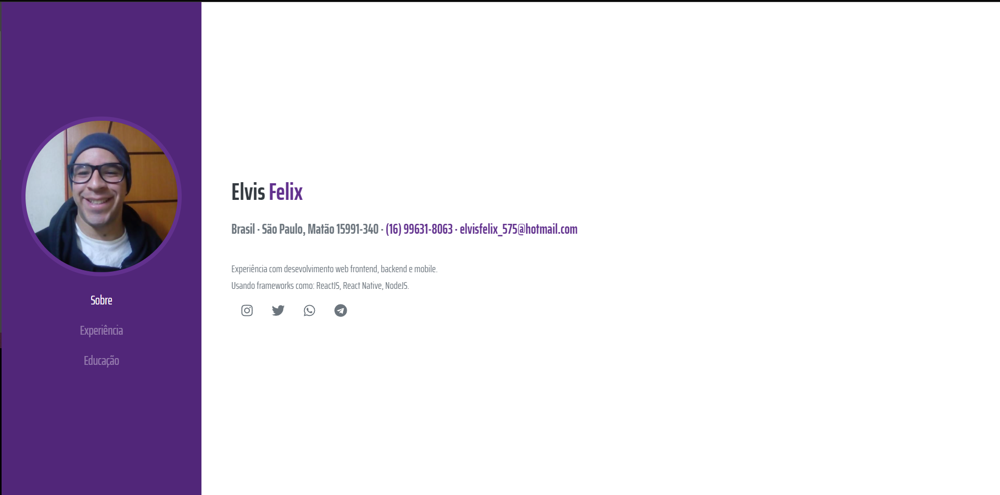

# Portfolio Elvis Felix



## Tecnologias usadas no projeto:

### ° [ReactJS](https://github.com/facebook/react)
### ° [Styled Components](https://github.com/styled-components)
### ° [Typescript](https://github.com/microsoft/TypeScript)

## :zap: Executando o Projeto
#### Clonando o projeto
```sh
$ git clone https://github.com/ElvisFelix-dev/portfolio
$ cd portfolio
$ yarn
$ yarn start
```
